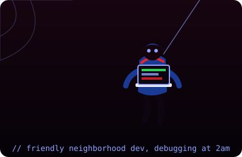

<div align="center">




</div>

<br>

<h3><code>alkinoos@github:~$ neofetch</code></h3>

<table>
<tr>
<td valign="top" width="60%">

```
NAME          Alkinoos Polyzos
ROLE          Electrical & Computer Engineering student · Full-Stack Developer
LOCATION      Greece
FOCUS         Software Engineering · Applied AI · Robotics · Embedded Systems
STACK         Python · Java · JS/React · C/C++ · Kali Linux · Wireshark
STATUS        ● building — always something on the bench
UPTIME        since first line of code, still compiling
```

</td>
<td valign="top" width="40%" align="center">



</td>
</tr>
</table>

<br>

<h3><code>alkinoos@github:~$ cat education.txt</code></h3>

**University of Western Macedonia**
Dept. of Electrical & Computer Engineering — currently studying

<br>

<h3><code>alkinoos@github:~$ ./activity_log</code></h3>

<p>Click any graph below to jump straight to your live contribution activity on GitHub.</p>

<details open>
<summary><b>🕸️ Snake mode</b> — click to collapse</summary>
<br>

<a href="https://github.com/Alkinoos005?tab=overview">
<!--START_SECTION:snake-->

<!--END_SECTION:snake-->
</a>

</details>

<details>
<summary><b>📊 Plain contribution graph</b> — click to expand</summary>
<br>

<a href="https://github.com/Alkinoos005?tab=overview">

</a>

</details>

<br>

<h3><code>alkinoos@github:~$ ./stats</code> 🔥📈</h3>

<div align="center">

<a href="https://github.com/Alkinoos005?tab=overview">

</a>

<br><br>

<a href="https://github.com/Alkinoos005?tab=followers"></a>
<a href="https://github.com/Alkinoos005?tab=repositories"></a>

<br><br>

<sub># dropped the old vercel.app stats card for good — it kept breaking
for you specifically. streak-stats.demolab.com and img.shields.io have
been rock solid all conversation, so everything here now runs on those.</sub>

</div>

<br>

<h3><code>alkinoos@github:~/projects$ ls -la --show-cool-stuff</code></h3>

| project | status | what it is |
|---|---|---|
| **jarvis/** | `wip` | Personal AI assistant running locally — voice input, task automation, a growing set of skills. |
| **lock-in/** | `wip` | Focus app with stakes. Locks distracting apps during a session; break early and you lose your reward. |
| **fitness-app/** | `building` | Workout and progress tracker built around consistency over intensity. |
| **arise/** | `building` | Morning-routine app that turns waking up early into a daily win instead of a chore. |
| **embedded-systems/** | `active` | Arduino Uno & ESP32 builds plus 3D-printed enclosures. |
| **smart-home/** | `in progress` | Homegrown smart-home setup — ESP32 nodes, sensors, automation logic. |
| **walle/** | `wip` | A WALL-E-inspired robot build — chassis, movement, a bit of personality. |
| **[AlkinoosTech](https://github.com/Alkinoos005/AlkinoosTech)** | `public` | Main GitHub project space. |
| **[Portfolio Website](#)** | `public` | Personal terminal-themed portfolio, built from scratch. *(send me the live link)* |

<br>

<h3><code>alkinoos@github:~$ cat stack.txt</code> 🧬⚡</h3>

```
Python                            ████████████░░  85%
Java                              █████████░░░░░  65%
C / C++                           ██████████░░░░  70%
JavaScript / React                ██████████░░░░  70%
HTML / CSS                        ███████████░░░  80%
SQL                               ████████░░░░░░  60%
Embedded (Arduino/ESP32)          ███████████░░░  80%
Kali Linux                        ████████░░░░░░  55%
Wireshark                         ███████░░░░░░░  50%
Ethical Hacking & Cyber Security  ████████░░░░░░  55%
ML / PyTorch                      ████████░░░░░░  60%
ROS / Robotics                    ████████░░░░░░  55%
3D Printing / CAD                 █████████░░░░░  65%
Git / Linux                       ███████████░░░  80%
```

<br>

<h3><code>alkinoos@github:~$ ./contact</code></h3>

<div align="center">

<a href="https://www.linkedin.com/in/alkinoos-polyzos-b6149335a/"></a>&nbsp;&nbsp;&nbsp;
<a href="https://www.instagram.com/alkinoos_polyzos/"></a>&nbsp;&nbsp;&nbsp;
<a href="https://github.com/Alkinoos005"></a>&nbsp;&nbsp;&nbsp;
<a href="mailto:alkinoospolyzos23@gmail.com"></a>

<br><br>

**Alkinoos Polyzos** &nbsp;·&nbsp; `@alkinoos_polyzos` &nbsp;·&nbsp; `@Alkinoos005` &nbsp;·&nbsp; alkinoospolyzos23@gmail.com

<br>

[](mailto:alkinoospolyzos23@gmail.com?subject=Priority%20Channel%20Request&body=Name%3A%20%0APhone%3A%20%0AMessage%3A%20%0A%0ATell%20me%20who%20you%20are%20and%20leave%20your%20number%20%E2%80%94%20I%27ll%20get%20back%20to%20you%20with%20mine.)

<sub>tap it, tell me your name and number, I'll reply with mine.</sub>

</div>

<br>

<div align="center">
<sub><i>"I know I've made some very poor decisions recently, but I can give you my complete assurance my work will be back to normal."</i></sub>
</div>


